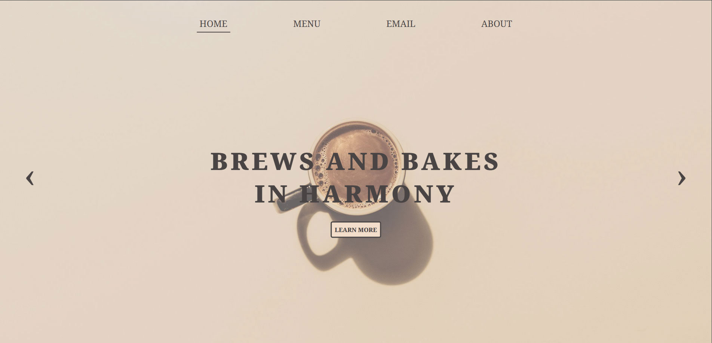
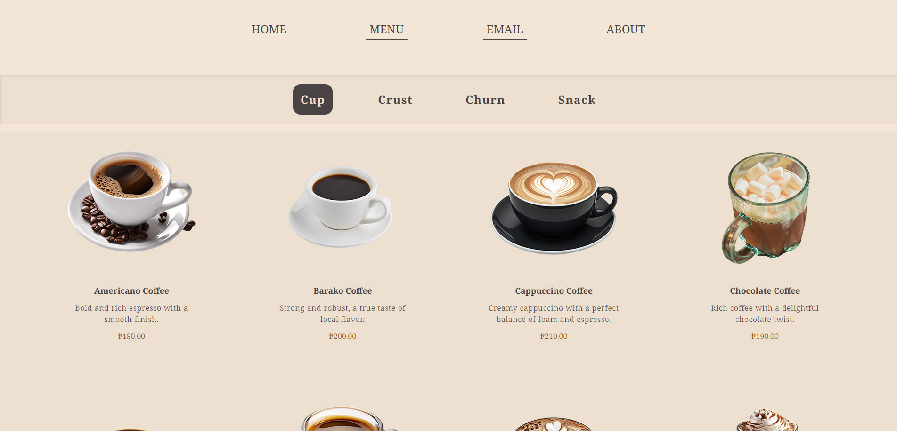
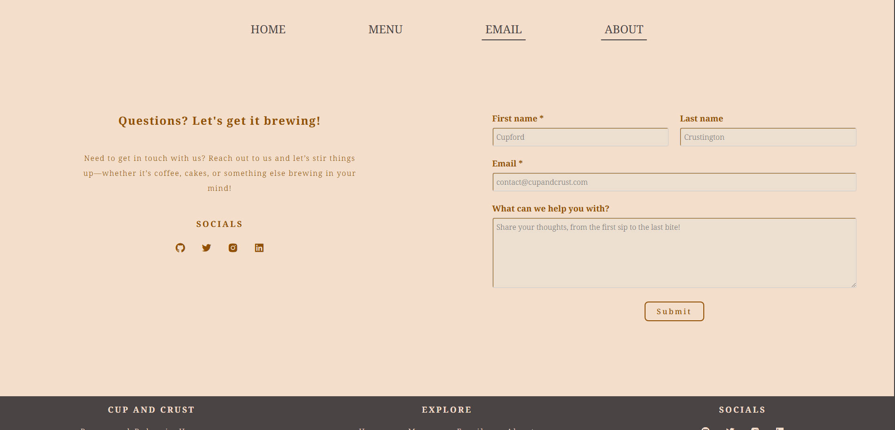
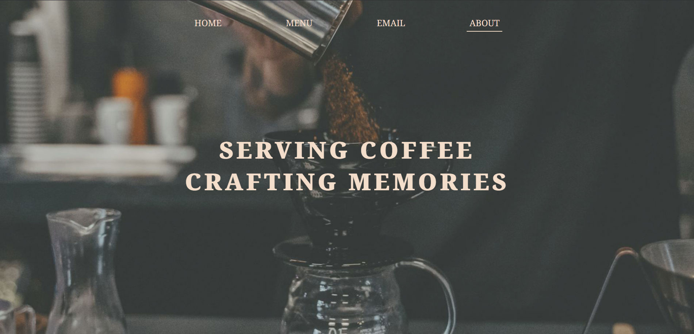

# Project: Restaurant Page

## Overview

This project is a dynamic and responsive mock restaurant website built using JavaScript, HTML, and CSS. It includes multiple pages, components, and interactive elements designed to offer a smooth and engaging user experience.

The website features a clean and modern layout, showcasing the restaurant’s offerings, such as the menu, an about section, and social media links. The project uses various interactive components, such as a carousel, featured cards, form validation for a contact form, and smooth scrolling effects for better navigation.

[Odin Restaurant Page](https://krig6.github.io/odin-restaurant/) - A deliciously interactive experience!

## Screenshots

## Technologies Used

- **JavaScript**: Used for the restaurant page's core functionality.
- **Webpack**: Bundles assets and optimizes code for production (includes webpack.dev.js and webpack.prod.js).
- **GSAP**: Animation library for smooth, high-performance animations.
- **CSS**: Styles implemented with CSS, bundled using CSS Loader and Style Loader.
- **HTML Webpack Plugin**: Generates index.html and injects bundled JavaScript.
- **ESLint**: Ensures code quality and consistency through static analysis.
- **Terser**: Minifies JavaScript for optimized file sizes in production.
- **gh-pages**: Deploys the app to GitHub Pages.

## Features

### Home Page

#### Dynamic Carousel:

- **Multiple Slides**: The carousel displays a series of slides, each with dynamic content like a headline, CTA (Call to Action) section, and an action button.
- **Data-driven Content**: The slides are generated based on the carouselContent.json data, allowing easy updates without modifying the code.
- **Customizable Buttons**: The carousel includes customizable buttons (e.g., previous/next) for navigation, with each button's label and functionality defined in the JSON data.
- **Interactive Call-to-Action**: Each slide includes a CTA section with a headline and button, encouraging user interaction.
- **Image Transitions**: Carousel images transition smoothly both manually with swipe/slide gestures, button controls and automatically, providing a dynamic and engaging browsing experience.
- **Static Featured Image**: When the carousel slides to the right or left, a static image is displayed. During this transition, site navigation and CTA texts dynamically change to lighter colors for better contrast, enhancing both readability and the visual appeal of the homepage.

#### Featured Links Section:

- **Featured Cards**: Displays a series of featured link cards, each containing an image, title, and description. These cards link to external pages or sections, offering quick access to relevant content.
- **Dynamic Content**: The featured links are generated based on the featuredLinks.json data, making it easy to update the content without code changes.
- **Image and Text Combination**: Each card includes an image, a title, and a brief description, making it visually appealing and informative.
- **Interactive Links**: Each card is clickable, leading users to additional content, improving the site's interactivity and navigation

### Menu Page

#### Product Grid:

- **Category Selection**: Displays a section containing product categories, making it easy for users to explore different sections (e.g., brews, bakes, churns, and snacks).
- **Dynamic Product Cards**: The menu grid displays product cards, each representing an item with an image, name, description, and price. These cards are dynamically created from the items array.
- **Customizable Content**: The product items are passed into the function dynamically, allowing for flexible updates and additions to the menu without modifying the code.
- **Category-based Grid**: The menu grid is structured by categories, with each category’s products displayed in a neat grid layout.

### Email Page

- **Information Block**: Displays a heading, description, and social media icons.
- **Contact Form**: Includes validation (email submission pending implementation).
- **Submit Button**: Customizable label and styling.
- **Social Media Links**: Dynamically generated from `emailFormData`.

### About Page

#### Hero Section:

- **Hero Image**: The page features a striking hero image, typically showcasing a barista in action, which sets the tone for the "About" section. This image adds a personal touch and helps to create an inviting atmosphere for visitors.
- **Hero Text Overlay**: The hero image is complemented by an overlay text, which provides a brief introduction or message about the restaurant. This text is designed to capture the visitor’s attention while setting the theme for the rest of the page.

#### About Section:

- **Dynamic Content**: The About section is made up of several segments, each displaying a title, a description, and an image. The content for these segments is generated dynamically from a JSON data source, ensuring that it can be easily updated, modified, or expanded without the need to change the core code.
- **Fictional Narrative**: This section presents an engaging, fictional story about the restaurant, highlighting its imagined history and values. Though the story is not based on actual events, it aims to provide a compelling and personalized experience for visitors, offering insight into the "character" of the restaurant and creating a connection with the audience.

### Additional Features:

- **Media Responsive**: The About Page is fully responsive, ensuring it looks great on all devices, from desktops to tablets and smartphones. The layout adjusts seamlessly to different screen sizes, providing an optimal browsing experience.
- **Parallax Effect**: The About Page incorporates a smooth parallax effect on images, creating a dynamic and engaging visual experience as users scroll. This effect adds depth to the page and enhances user interaction.

## Learning Path

This project took me a while to complete, but I genuinely enjoyed the process and learned a great deal along the way. I gained hands-on experience with linting, working with JSON data, and refining my approach to writing single-responsibility functions. Selecting the right images was a challenge, but I also strengthened my CSS skills—especially with media queries—and sharpened my debugging abilities. Throughout the project, I found myself continuously refining my work; what seemed finished one day often had room for improvement the next.

Midway through, I explored [Neovim](https://neovim.io/) and configured my [dotfiles](https://github.com/krig6/.dotfiles), adding a new layer of customization to my workflow. Learning Neovim during this process not only enhanced my efficiency but also reinforced my ability to adapt to new tools and optimize my development environment.

This project was especially meaningful to me, as I dedicated significant time and effort to perfecting it. I also drew inspiration from [La Pierre Qui Tourne](https://www.lapierrequitourne.com/), which influenced both the layout and visual effects of my page. Overall, it was a deeply rewarding experience.

## Future Enhancements

- User Authentication
- Back-end Integration
- Dark Mode Toggle
- Menu Search Functionality
- Advanced Animations
- Accessibility Improvements
- Multi-language Support
- Performance Optimization
- SEO Optimization
- Analytics Integration

## Acknowledgments

### Resource and Tools

- [The Odin Project](https://www.theodinproject.com/) 
- [Neovim](https://neovim.io/) 
- [Google Fonts](https://fonts.google.com/) 
- [La Pierre Qui Tourne](https://www.lapierrequitourne.com/) 
- [Boxicons](https://boxicons.com/) 
- [Flaticon](https://www.flaticon.com/) 
- [TinyPNG](https://tinypng.com/) 

### Photography Credits

- [Jakub Dziubak](https://unsplash.com/@jckbck) 
- [Jamie Street](https://unsplash.com/@jamie452) 
- [Konstantin Mishchenko](https://www.pexels.com/@frendsmans/) 
- [Hermes Rivera](https://unsplash.com/@hermez777) 
- [Lexi Anderson](https://unsplash.com/@lexianderson) 
- [Anna Tarazevich](https://www.pexels.com/@anntarazevich/) 
- [Bram.](https://unsplash.com/@br_am) 
- [The Design Lady](https://unsplash.com/@sarah35) 
- [Alyona Yankovska](https://unsplash.com/@alyonayankovska)
